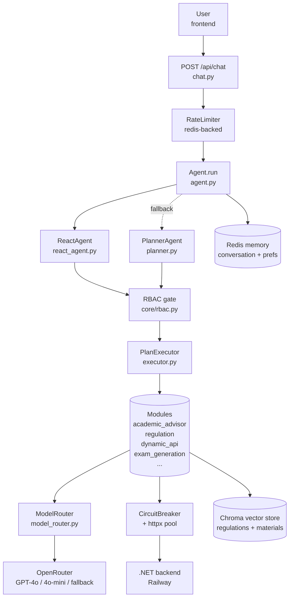

# FastAPI AI Orchestration Service

AI middleware for the University Management System. Sits between the
frontend, an OpenRouter-routed LLM stack, and a .NET 9 backend; handles
all AI features (chat, exam generation, RAG, academic advising, regulation
Q&A, complaint intelligence, etc.).

- **Stack:** FastAPI 3.0, Python 3.13, OpenRouter (OpenAI-compatible),
  ChromaDB for RAG, Redis for memory + rate limiting, HuggingFace local
  models (BART, Flan-T5, TinyLlama) for free-tier tasks.
- **Deployment:** Railway. Separate service from the .NET backend.
- **Start command:** `uvicorn app.main:app --host 0.0.0.0 --port $PORT`

---

## Architecture at a glance



---

## Request flow (chat path)

1. **Rate limit** — sliding-window per `user_id` in Redis (in-memory fallback).
2. **Memory load** — past conversation, preferences, academic profile.
3. **Planning** — `ReactAgent` (function-calling loop) is the primary path;
   the keyword/LLM `PlannerAgent` is the fallback.
4. **RBAC gate** — `core/rbac.py` denies the request if the role isn't
   permitted to trigger this intent. Audit-logged via `log_blocked_attempt`.
5. **Module dispatch** — `PlanExecutor` looks up the intent in
   `_MODULE_CLASS_MAP` and routes to the matching module (e.g.
   `AcademicAdvisorModule` for `academic_advice`).
6. **Module work** — module composes context, calls the LLM via
   `ModelRouter`, and/or calls the .NET backend via `ToolExecutionClient`.
7. **LLM narration** — raw backend data is narrated in role-appropriate
   language (student / doctor / admin / superadmin system prompts).
8. **Response + suggestions** — final text + deterministic follow-up
   suggestions returned to the client.
9. **Memory save + (optional) background summarization** — fire-and-forget.

---

## Folder layout (focused)

```
app/
├── main.py                       # FastAPI lifespan, routes, middleware
├── agents/
│   ├── agent.py                  # Top-level orchestrator
│   ├── react_agent.py            # Function-calling primary planner
│   ├── planner.py                # Legacy keyword/LLM planner (fallback)
│   ├── executor.py               # Module dispatcher + role-aware narration
│   ├── model_router.py           # OpenRouter + Gemini + local HF routing
│   ├── execution_context.py      # Immutable carrier object
│   └── schemas.py                # Plan / Step / ExamParams DTOs
├── modules/
│   ├── academic_advisor.py       # v2 — regulation RAG + my-roadmap + overview
│   ├── regulation.py             # RAG-first regulation Q&A
│   ├── dynamic_api.py            # LLM picks backend endpoint dynamically
│   ├── exam_generation.py        # AI exam generation pipeline
│   ├── material_explanation.py
│   ├── material_qa.py
│   ├── complaint.py
│   ├── cv_analysis.py
│   ├── file_extraction.py
│   ├── file_processor.py
│   ├── result_query.py
│   └── summarization.py
├── services/
│   ├── backend_client.py         # httpx pool + circuit breaker → .NET
│   ├── circuit_breaker.py        # Async circuit breaker (in-house)
│   ├── memory_store.py           # Redis conversation + preferences
│   ├── embedding_service.py      # Text → vectors (with keyword fallback)
│   ├── vector_store.py           # Chroma async-safe wrapper
│   ├── regulation_indexer.py     # Index regulation PDFs into RAG
│   ├── chunker.py
│   ├── tool_registry.py          # Intent → module mapping
│   └── model_service.py          # Local HuggingFace inference
├── api/routes/
│   ├── chat.py                   # POST /api/chat
│   ├── complaint_intelligence.py # POST /api/ai/analyze-complaint
│   ├── exam_generation_api.py    # POST /generate-exam
│   ├── ai_grading.py             # POST /api/ai/grade-submission
│   ├── rag.py                    # /api/rag/* (index, search, regulations)
│   └── memory.py                 # /api/memory/* (academic profile)
├── core/
│   ├── config.py                 # Pydantic Settings
│   ├── rbac.py                   # Role → allowed intents (source of truth)
│   ├── api_discovery.py          # .NET Swagger filter + allowlist
│   ├── middleware.py             # Correlation ID + timing
│   ├── rate_limiter.py
│   ├── prompt_safety.py          # Injection defense (sandwich + tags)
│   └── logging.py
├── schemas/                      # Typed contracts (Phase 4)
│   ├── intents.py                # Intent + Role enums (str-Enum)
│   └── contracts.py              # AcademicContext Pydantic model
└── prompts/                      # Externalized prompts (Phase 3)
    ├── __init__.py               # Loader + cache + frontmatter parser
    ├── role_student.md
    ├── role_doctor.md
    ├── role_admin.md
    └── role_superadmin.md

tests/
├── conftest.py                   # Env setup
├── test_rbac.py                  # Permission matrix tests
├── test_circuit_breaker.py       # State machine tests
├── test_prompt_safety.py         # Injection defense tests
├── test_schemas.py               # Enum + contract tests
└── test_prompts.py               # Prompt loader tests
```

---

## Production hardening highlights (Phase 5)

The service was hardened in a recent pass. Key changes:

| Concern | Fix | Where |
|---|---|---|
| Event loop blocked on Chroma sync calls | `asyncio.to_thread` wrappers | `services/vector_store.py`, `services/regulation_indexer.py` |
| OpenRouter hangs would tie up workers | Per-call timeout (45s) + `max_retries=0` (fallback chain owns retries) | `main.py`, `core/config.py` |
| .NET outage cascaded into worker exhaustion | Circuit breaker (5 fails → open 30s → half-open trial) | `services/circuit_breaker.py`, `services/backend_client.py` |
| One httpx client per request (no pooling) | Single shared `AsyncClient` (max 100 conns, 20 keepalive) | `services/backend_client.py` |
| DynamicApi retry loop = 5 LLM calls/request | `MAX_ATTEMPTS=3` + 25s overall `asyncio.wait_for` ceiling | `modules/dynamic_api.py` |
| Prompt injection via raw user content | `<USER_MESSAGE>` wrapper + closing-tag escape + sandwich `INJECTION_GUARD` | `core/prompt_safety.py` |
| 290-line system prompts hardcoded | Externalised to `app/prompts/*.md` + Jinja-style loader (stdlib only) | `prompts/` |
| Magic strings for intents/roles | `Intent` + `Role` str-Enums (back-compat) + `AcademicContext` Pydantic | `schemas/` |

All changes are backward-compatible: every existing call site still works,
every public DTO has the same shape. New code can opt into the typed APIs.

---

## Tests

```bash
pip install pytest pytest-asyncio
python -m pytest tests/ -v
```

Current suite: **63 tests passing** covering RBAC matrix, breaker state
machine, prompt injection defenses, schema enums + drift checks, and
prompt loader.

---

## Local setup

1. **Python 3.10+** required (developed on 3.13).
2. **Install:**
   ```bash
   pip install -r requirements.txt
   ```
3. **Environment** — copy `.env.example` to `.env` and set:
   ```
   BACKEND_BASE_URL=https://your-dotnet.up.railway.app   # required
   OPENROUTER_API_KEY=sk-or-...                           # required
   REDIS_URL=redis://...                                  # optional (graceful fallback)
   ALLOWED_ORIGINS=https://your-frontend.example.com
   OPENROUTER_FALLBACK_MODEL_1=openai/gpt-4o-mini
   OPENROUTER_FALLBACK_MODEL_2=mistralai/mistral-7b-instruct
   ```
4. **Run:**
   ```bash
   uvicorn app.main:app --reload --port 8000
   ```
5. Open Swagger UI at `http://localhost:8000/docs`.

---

## Railway deployment

- Connect the GitHub repo as a Railway service.
- Set the env vars listed above in the **Variables** tab.
- Start command: `uvicorn app.main:app --host 0.0.0.0 --port $PORT`
- Railway auto-detects Python + `requirements.txt`.

---

## Adding a new intent (4 places to update — keep them in sync)

1. **`app/schemas/intents.py`** — add the enum member.
2. **`app/core/rbac.py`** — add it to the relevant role frozensets.
3. **`app/agents/planner.py`** — add to `VALID_INTENTS` + the system prompt rule.
4. **`app/agents/executor.py`** — add to `_MODULE_CLASS_MAP` pointing at the new module.

The `test_no_drift_with_rbac_module` test catches drift between (1) and (2).

---

## Prompt editing

System prompts live in `app/prompts/*.md` with frontmatter:

```markdown
---
version: 2.0
owner: ai-team
last_reviewed: 2026-05-26
---
prompt body in markdown...
```

Edit the `.md` file → restart the service (or call the cache-clear endpoint
when wired up). No code change required.

---

## Roadmap (post-defense)

- **Phase 2** — full ReactAgent refactor, retire legacy planner
- **Phase 6** — RabbitMQ + MassTransit for notifications (.NET side)
- **Phase 7** — DB optimisation (N+1 hunts, projections, indexes)
- **Phase 8** — OpenTelemetry tracing + Prometheus metrics + dashboards
